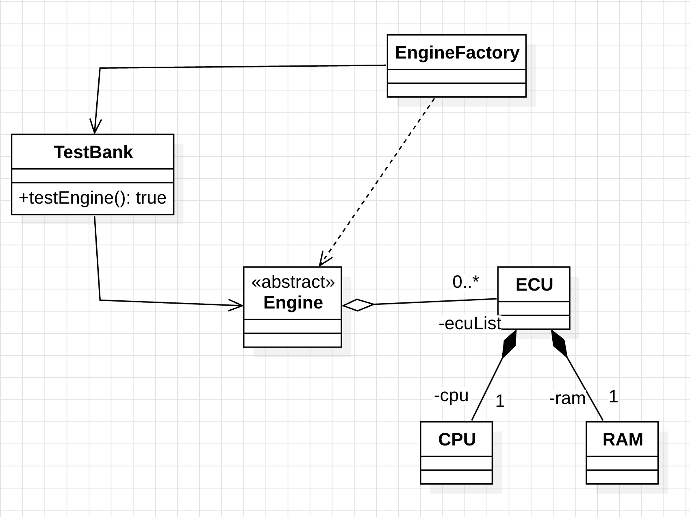
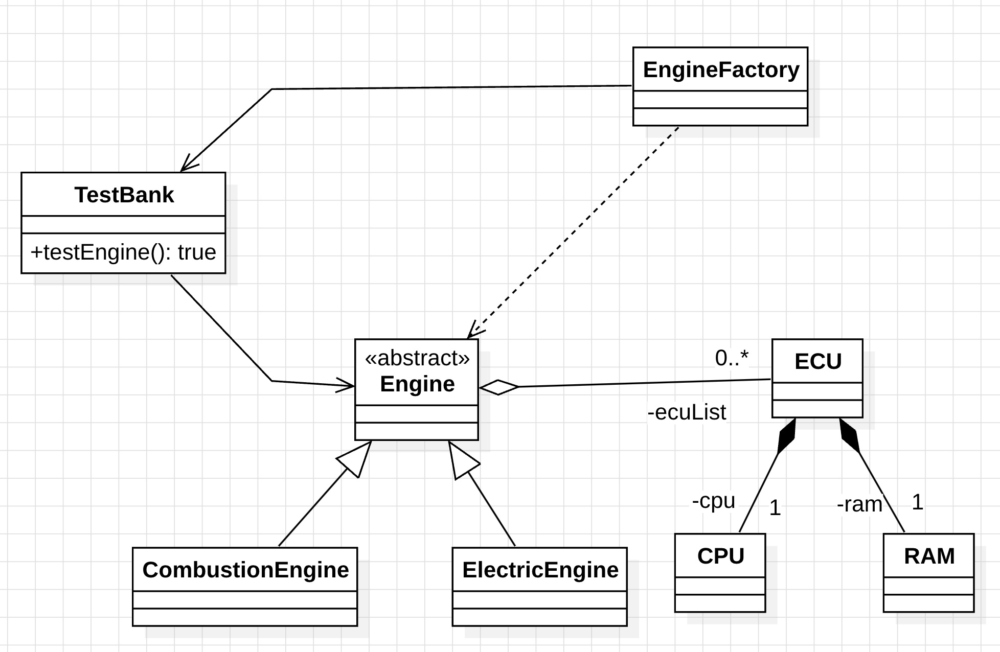
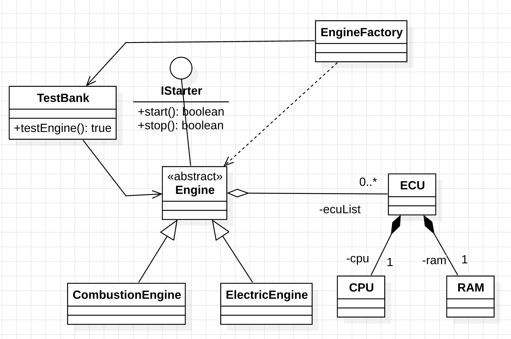

# UML Class Diagram Relations - Java Demo

This project demonstrates **UML class diagram relationships** through a simple Java application modeled around an engine manufacturing domain. The focus is on illustrating the **structural relations between classes** (how classes are connected), not on runtime behavior or business logic.

Each subpackage (`d1`, `d2`, `d3`) presents an **incremental version** of the same application, progressively introducing more UML relationships.

## StarUML Diagram

The file [`umldiagram.mdj`](umldiagram.mdj) in the root folder contains the full StarUML project with the class diagrams for all three versions. It is compatible with **StarUML 6.x**.

---

## UML Relationships Demonstrated

| Relationship               | Description                                                                 |
|----------------------------|-----------------------------------------------------------------------------|
| **Composition**            | Strong ownership — the part cannot exist without the whole (e.g. `ECU` creates and owns `CPU` and `RAM`) |
| **Aggregation**            | Weak ownership — the part can exist independently (e.g. `Engine` holds a list of `ECU`s) |
| **Association**            | A structural link between two classes (e.g. `EngineFactory` ↔ `TestBank`)  |
| **Dependency**             | A transient, usage-only relationship (e.g. `EngineFactory.createEngine()` locally creates `ECU` and `Engine`) |
| **Inheritance**            | A subclass extends a superclass (e.g. `CombustionEngine` extends `Engine`) |
| **Interface Implementation** | A class realizes an interface (e.g. `Engine` implements `IStarter`)       |

---

## Subpackages

### d1 — Composition, Aggregation, Association, and Dependency

**Package:** `utcluj.aut.d1`

This first version introduces the core structural relationships:

- **Composition:** `ECU` internally creates `CPU` and `RAM` — these parts are fully owned by `ECU` and do not exist outside of it.
- **Aggregation:** `Engine` maintains a list of `ECU` objects that are added externally via `addECU()`.
- **Association:** `EngineFactory` holds a reference to `TestBank` (passed via constructor), and `TestBank` temporarily holds a reference to an `Engine` for testing.
- **Dependency:** `EngineFactory.createEngine()` locally instantiates `ECU` and `Engine` — it uses them but does not own them as fields.

---

### d2 — Adding Inheritance

**Package:** `utcluj.aut.d2`

This version builds on `d1` by introducing **inheritance**:

- **Inheritance:** `CombustionEngine` and `ElectricEngine` extend `Engine`, each adding specialized attributes (`fuelType`, `voltage`).
- All relationships from `d1` (composition, aggregation, association, dependency) remain present.

---

### d3 — Adding Interface Implementation

**Package:** `utcluj.aut.d3`

This final version adds **interface implementation** and makes `Engine` abstract:

- **Interface Implementation:** `Engine` implements the `IStarter` interface, which declares `start()` and `stop()`.
- **Inheritance:** `CombustionEngine` and `ElectricEngine` extend the now-abstract `Engine` and provide concrete implementations of `start()` and `stop()`.
- All relationships from `d1` and `d2` remain present.

---

## Note

The purpose of this project is purely **educational** — it is designed to illustrate how different types of relationships between classes map to UML class diagram notation. The application logic is intentionally minimal; the emphasis is on **class structure and inter-class relations**, not on functional behavior.